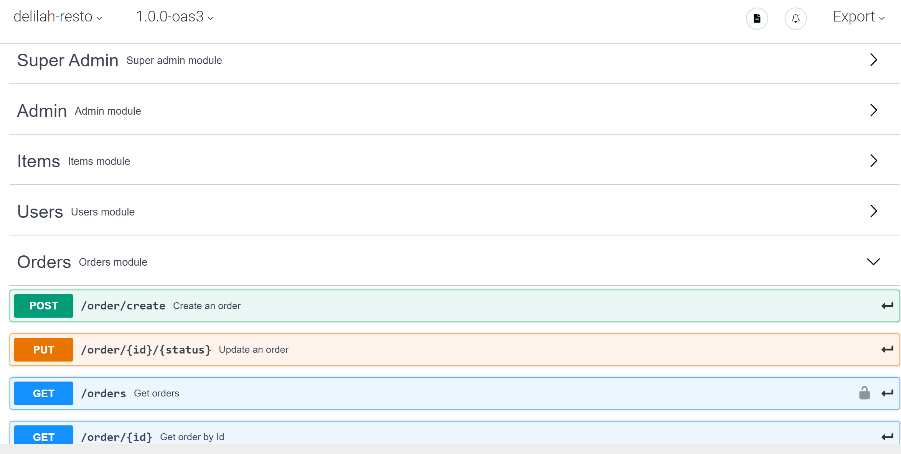

# Delilah
RESTful API for a food delivery system

Hello there, in order to correctly install and test this project, please follow this next steps:

<ol>
  <li>Clone the project via <b>HTTPS</b></li>
  <li>Install dependencies with the command 'npm install'</li>
  <li>Manually import the SQL Database on your local DB client. You'll find the .sql file in /src/DB/delilah_DB.sql</li>
  <li>Run the project locally using the command 'npm start'. It will start the server</li>
  <li>Test locally using an HTTP client such as <a href= "https://www.postman.com/">Postman</a></li>
</ol>

<h3><a href="https://app.swaggerhub.com/apis/juanguren/delilah-resto/1.0.0-oas3">Follow the instructions of its API</a></h3>
</img>
